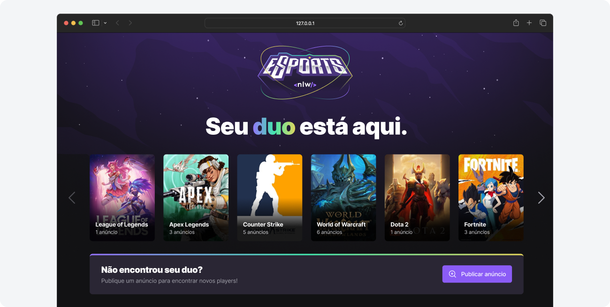
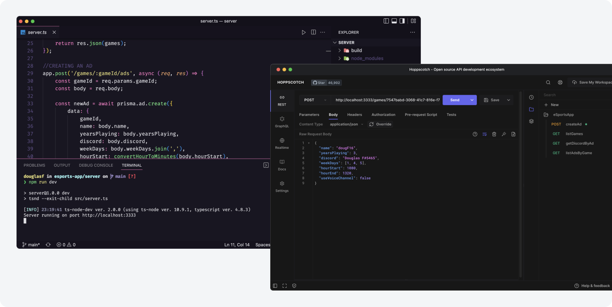
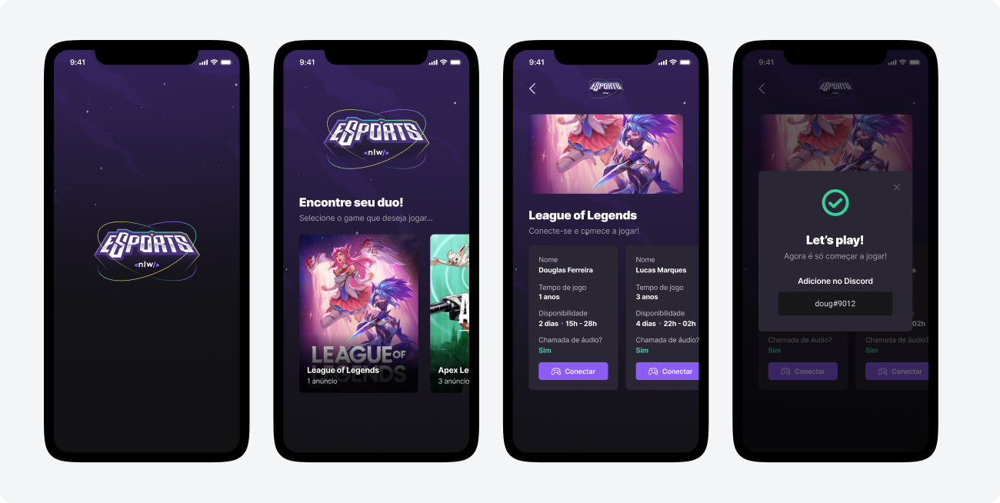

# Esports full-stack app - Exercise from NLW by Rocketseat

-   [About](#about)
-   [Web client](#web-client)
-   [Web server/API](#web-serverapi)
-   [Mobile client](#mobile-client)
-   [Installation](#installation)
-   [Extra notes](#extra-notes)

 

## About

The application allows users to publish their availability, find and connect to other users playing the same, so they can play together.

In this project, the premise was to explore the basics of client-server architecture. The backend exposes a simple REST API to serve and create resources based on incoming requests. On the client side, the web and mobile apps are responsible for communicating with the server as well as providing an interface for handling user interactions.

 

## Web client

 

Web client built with ReactJS. Main features include listing games and create ads.

### Tools

-   TypeScript
-   ReactJS
-   TailwindCSS
-   Radix UI
-   Axios

 

## Web server/API

 

Rest API with routes for listing and creating resources.

### Tools

-   NodeJS
-   ExpressJS
-   Prisma ORM
-   SQlite
-   TypeScript

 

## Mobile client

 

Cross-platform mobile client built with React Native. Main features include browse ads and find players.

### Tools

-   TypeScript
-   React Native
-   Expo

 

## Installation

-   Navigate to an application root directory (mobile, server or web)
-   Install dependencies by running `npm install`
-   Run the application with `npm run dev`

Two things to keep in mind:

-   You may install and run the server before running the client apps
-   As of today, none of the applications in this project is ready for deployment

 

## Extra notes

-   As an exercise, this project wasn’t focused on advanced optimizations regarding data storage, processing, accessibility, scalability, cross-browser compatibility, etc. There’s still a lot to be done about it.
-   As most projects, this one is not bug/error-free. If you find any bug or unexpected behavior, feel free to get in touch, here is my email - dfaferreira46@gmail.com
